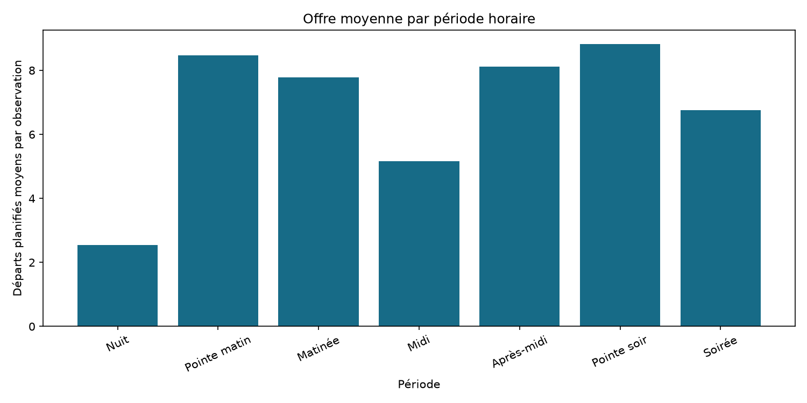
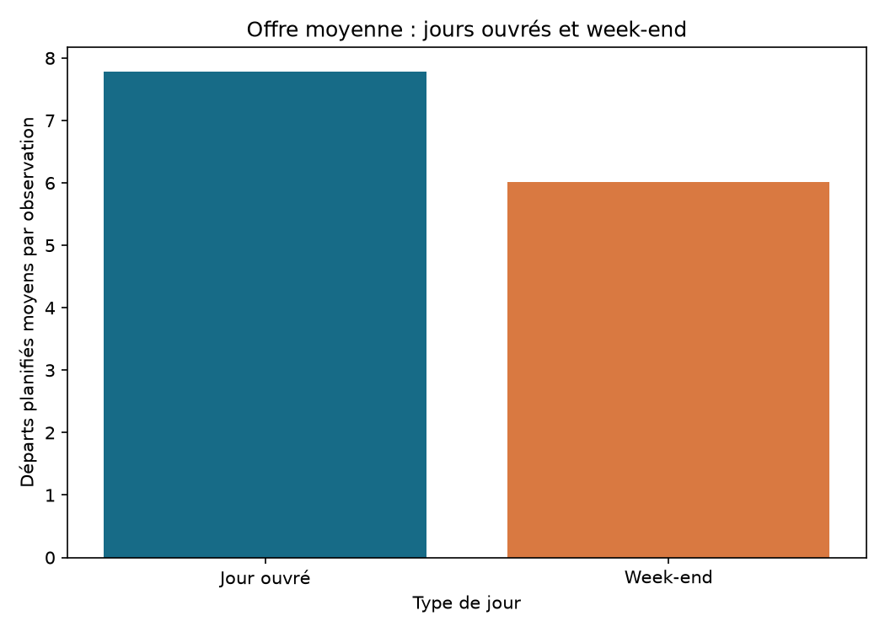
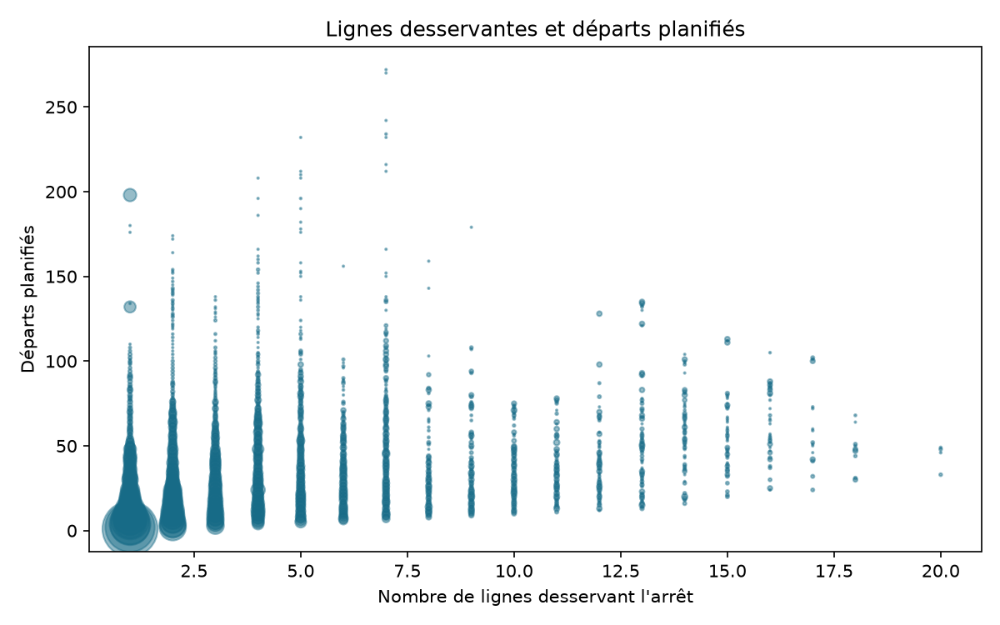

# Étape 4 - Analyse exploratoire, tendances et veille

## 1. Objectifs

Cette étape vise à explorer l'offre théorique de transport collectif dans les
Pays de la Loire, à identifier ses principales tendances et à mettre en
relation certains indicateurs d'offre.

L'analyse cherche notamment à répondre à la question suivante : quelles
tendances actuelles en IA et Big Data peuvent contribuer à mieux comprendre,
prévoir ou optimiser les transports publics ?

## 2. Données et méthode

L'analyse utilise la vue SQLite
`v_departures_by_stop_period`, construite à partir des données GTFS nettoyées.
Chaque observation correspond à un arrêt, une date de service et une période
horaire. L'indicateur principal est le nombre de départs planifiés
(`planned_departures`).

Trois hypothèses sont testées :

- H1 : l'offre varie selon les périodes horaires ;
- H2 : l'offre est plus importante les jours ouvrés que le week-end ;
- H3 : le nombre de lignes desservant un arrêt est positivement associé au
  nombre de départs planifiés.

Les moyennes sont calculées avec pandas et SQLite. Les résultats sont exportés
en CSV et représentés avec matplotlib. H1 et H2 sont étudiées avec des
moyennes par groupe. H3 utilise les corrélations de Pearson et de Spearman,
ainsi qu'un nuage de points. Les corrélations décrivent une association et ne
permettent pas d'établir une causalité.

## 3. Hypothèse H1 : périodes horaires

L’analyse montre une concentration de l’offre aux heures de pointe, avec un maximum en pointe du soir et un niveau également élevé en pointe du matin. L’offre est plus faible la nuit et à midi. Cette répartition semble correspondre aux périodes de déplacement domicile-travail ou domicile-école.

### Résultats

L’hypothèse est que l’offre varie selon les périodes de la journée.

L’offre est maximale pendant les pointes du matin et du soir.

### Interprétation

L'hypothèse H1 est confirmée. L'offre moyenne atteint 8,82 départs planifiés
en pointe du soir et 8,48 en pointe du matin. Elle reste élevée l'après-midi
avec 8,11 départs, mais diminue à 5,16 autour de midi et à 2,54 pendant la
nuit. Cette organisation suggère que l'offre est concentrée sur les périodes
de déplacements réguliers, notamment les trajets domicile-travail et
domicile-école. Il s'agit toutefois d'une interprétation de l'offre planifiée,
et non d'une mesure directe des comportements des voyageurs.

## 4. Hypothèse H2 : jours ouvrés et week-end

L'offre moyenne atteint environ 7,8 départs planifiés par observation les jours
ouvrés, contre environ 6,0 le week-end.

L'hypothèse H2 est confirmée : l'offre théorique est plus importante les jours
ouvrés. Elle diminue le week-end, ce qui peut s'expliquer par une demande
potentiellement plus faible et une organisation différente des services.

Cette analyse porte sur l'offre planifiée et non sur la fréquentation réelle.

## 5. Hypothèse H3 : lignes desservantes et départs

L'analyse mesure la relation entre le nombre de lignes desservant un arrêt
et le nombre de départs planifiés. Les corrélations de Pearson et de Spearman
permettent d'évaluer cette relation sous deux angles complémentaires.

Les corrélations obtenues sont de 0,4036 selon Pearson et de 0,4319
selon Spearman. Elles indiquent une relation positive modérée entre le
nombre de lignes desservant un arrêt et le nombre de départs planifiés.

L'hypothèse H3 est donc partiellement confirmée : les arrêts desservis par
plusieurs lignes disposent généralement d'une offre plus importante, mais la
dispersion observée montre que le nombre de lignes ne suffit pas à expliquer
à lui seul le niveau d'offre.

Cette corrélation ne permet pas de conclure à une relation de causalité.

## 6. Synthèse des tendances

L'analyse exploratoire met en évidence trois tendances principales.

Premièrement, l'offre est concentrée pendant les heures de pointe, avec un
niveau maximal le soir et un niveau également élevé le matin. Elle diminue
nettement la nuit et autour de midi.

Deuxièmement, l'offre moyenne est plus importante les jours ouvrés
(environ 7,8 départs planifiés par observation) que le week-end
(environ 6,0 départs).

Troisièmement, le nombre de lignes desservant un arrêt est positivement
corrélé au nombre de départs planifiés. Cette relation reste modérée, ce qui
montre que d'autres facteurs influencent le niveau d'offre.

## 7. Veille IA et Big Data

### Sujet choisi

L'intelligence artificielle et le Big Data au service de l'optimisation
des transports publics.

### 7.1 Prévoir la demande de transport

L'intelligence artificielle permet d'estimer la demande future de transport
à partir de données historiques et de données contextuelles. Les modèles
peuvent notamment exploiter les horaires, les jours de la semaine, les
vacances scolaires, la météo, les événements et les données de mobilité.

Ces prévisions peuvent aider les opérateurs à adapter la fréquence des
véhicules, à renforcer certaines lignes et à mieux répartir les ressources.
Dans le cadre de ce projet, une évolution naturelle serait d'utiliser les
données GTFS comme base historique, puis d'ajouter les données météo et,
si elles sont disponibles, des données de fréquentation réelle.

Cette évolution reste théorique dans le projet actuel, car les données
disponibles décrivent uniquement l'offre planifiée et non le nombre réel
de voyageurs.

### 7.2 Optimiser les itinéraires et les horaires

L'IA et les algorithmes d'optimisation peuvent également aider à construire
des horaires plus adaptés aux besoins des voyageurs. Ils peuvent comparer
la demande prévue, les temps de trajet, les correspondances, la capacité
des véhicules et les contraintes d'exploitation.

L'objectif est de proposer une offre plus efficace tout en limitant les
temps d'attente, les trajets à vide et les ruptures de correspondance.
L'analyse des arrêts faiblement desservis réalisée dans ce projet pourrait
constituer une première étape pour identifier les secteurs nécessitant une
amélioration de l'offre.

Cependant, une décision opérationnelle devrait également tenir compte des
coûts, des ressources disponibles et des données de fréquentation réelle.

### 7.3 Exploiter les données en temps réel

Les systèmes de transport produisent aujourd'hui de grandes quantités de
données : positions GPS, horaires réels, incidents, validations et
informations météorologiques. Leur analyse en temps réel permet d'informer
les voyageurs, de détecter les perturbations et d'adapter l'exploitation.

Les architectures Big Data facilitent le traitement de ces flux lorsqu'ils
sont trop volumineux ou trop rapides pour être analysés manuellement.
L'intelligence artificielle peut ensuite repérer des anomalies, prévoir des
retards ou proposer des actions correctives.

Dans ce projet, les données GTFS sont principalement statiques et décrivent
une offre théorique. Une évolution future consisterait à les compléter par
des données temps réel, des données de fréquentation et des historiques de
retards.

### 7.4 Synthèse de la veille

Les évolutions actuelles combinent l'intelligence artificielle, les
algorithmes d'optimisation et les architectures Big Data. Elles permettent
de mieux prévoir la demande, d'adapter les horaires et de réagir plus
rapidement aux perturbations.

Ces technologies présentent un intérêt pour l'analyse des transports
publics, mais leur pertinence dépend fortement de la qualité, de la
complétude et de la disponibilité des données. Elles ne remplacent pas
l'analyse métier : elles fournissent des outils d'aide à la décision.

### 7.5 Sources de veille

- Organisation de coopération et de développement économiques (OCDE) / Forum
  international des transports, [Artificial Intelligence in Transport](https://www.itf-oecd.org/artificial-intelligence-transport)
  (consulté le 18 septembre 2026).
- GTFS, *GTFS Realtime Reference*, documentation officielle du standard pour
  les positions de véhicules, les mises à jour de trajets et les alertes,
  [documentation GTFS Realtime](https://gtfs.org/documentation/realtime/reference/)
  (consultée le 18 septembre 2026).
- Commission européenne, *European data spaces*, informations sur les espaces
  européens de données et la circulation des données sectorielles,
  [European data spaces](https://digital-strategy.ec.europa.eu/en/policies/data-spaces)
  (consultée le 18 septembre 2026).

## 8. Limites de l'analyse

Cette analyse porte sur l'offre théorique décrite par les données GTFS. Elle
ne mesure pas la fréquentation réelle, les retards, les suppressions de
services ou le taux de remplissage des véhicules.

La météo disponible ne couvre qu'un point géographique et une période
limitée. Les corrélations observées ne permettent pas non plus d'établir
des relations de causalité.

Enfin, les données sont agrégées au niveau des arrêts et des périodes
horaires. Cette agrégation peut masquer des différences entre les lignes,
les territoires et les dates.

## 9. Conclusion

L'analyse exploratoire confirme que l'offre de transport varie selon les
périodes horaires et les types de jours. Elle est plus importante aux
heures de pointe et les jours ouvrés, tandis qu'elle diminue la nuit et le
week-end.

Le nombre de lignes desservant un arrêt présente une corrélation positive
modérée avec le nombre de départs planifiés. Ce critère peut donc aider à
identifier les secteurs mieux desservis, mais il doit être complété par
d'autres informations.

Les tendances étudiées en IA et en Big Data montrent que les données de
transport pourraient être utilisées pour prévoir la demande, optimiser les
horaires et réagir aux perturbations. Une prochaine étape serait d'ajouter
des données de fréquentation réelle et des données temps réel afin de
passer de l'analyse de l'offre planifiée à une aide à la décision plus
complète.
